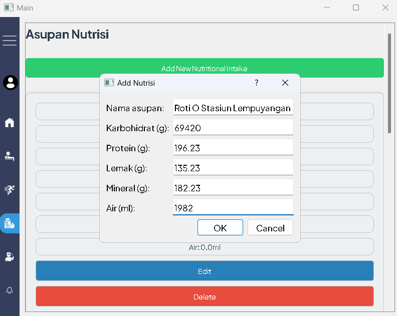

# Test untuk Fitur Asupan Nutrisi (Nutritional Intake)

### TC 1 - Input Kosong
Masukan:

Keluaran yang diharapkan: Muncul dialog peringatan untuk input kosong. Pengguna harus memasukkan kembali masukan hingga valid.

Keluaran yang ditampilkan: Sesuai.

### TC 2 - Input Nonnumerik
Masukan:

Keluaran yang diharapkan: Muncul dialog peringatan untuk memasukkan input bilangan desimal nonnegatif. Pengguna harus memasukkan kembali masukan hingga valid.

Keluaran yang ditampilkan: Sesuai.

### TC 3 - Input Negatif
Masukan:

Keluaran yang diharapkan: Muncul dialog peringatan untuk memasukkan input bilangan desimal nonnegatif. Pengguna harus memasukkan kembali masukan hingga valid.

Keluaran yang ditampilkan: Sesuai.

### TC 4 - Input Valid
Masukan:

Keluaran yang diharapkan: Asupan nutrisi berhasil ditambahkan dan muncul di layar.

Keluaran yang ditampilkan: Sesuai.

